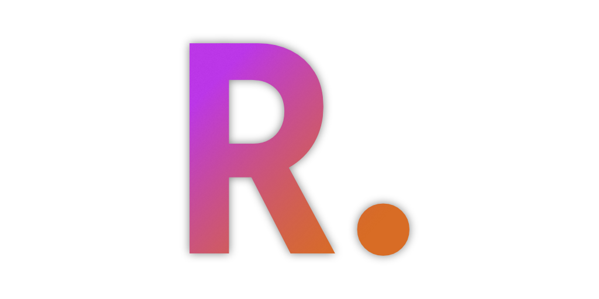
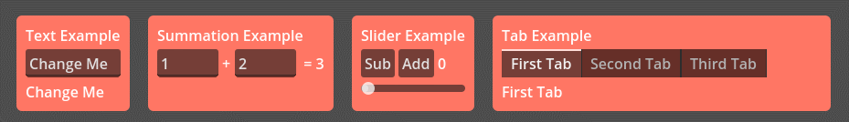

# Rdot (JavaScript Signals for Godot! 🥳)



## What is Rdot?

Rdot is inspired by most modern Web Frameworks that use a reactive programming model. It enables you to write GDScript with syntax similar to [Vue](https://vuejs.org/) / [Solid](https://www.solidjs.com/) / [Qwik](https://qwik.dev/) and many other Frameworks... but in Godot!



The most common use case for Rdot is to synchronize the state of your game with the UI, although it can be used for other things as well.

## ⚠️ Disclaimer ⚠️

This should be seen as a proof of concept and **not ready for production**. While most logic was ported over, there still needs to be more testing to be done.

Logic was sourced from [proposal-signals](https://github.com/proposal-signals/proposal-signals) and translated to GDScript.
Big shoutout to everyone who contributed to the proposal or worked on the demo in said proposal. ❤️

## Usage

```gdscript
var counter = R.state(0)

var displayText = R.computed(func(_ignore):
    return "Counter: " + str(counter.value)
)

$AddButton.button_down.connect(func(): counter.value += 1)
$SubtractButton.button_down.connect(func(): counter.value -= 1)

R.effect(func(_ignore):
    $CounterLabel.text = displayText.value
)
```

More examples can be found in the [demo](https://github.com/Nitwel/Rdot/tree/main/demo) folder.

### Explanation

`R.` (R-dot) is the namespace for all Rdot functions.

`R.state` is a function that creates a reactive state. It returns an object with a `value` property that you can read and write to.
The methods `do_get` and `do_set(value)` are also available but behave the same as `value`.
```gdscript
var counter = R.state(0)
```

`R.computed` recalculated it's value each time a reactive value in the function changes. It returns an object with a `value` property that you can read.
The first argument can be ignored but has to be there for Godot to not complain.
```gdscript
var double = R.computed(func(_ignore):
    return counter.value * 2
)
```

`R.effect` can be used to synchronize the reactive state with the UI. It its rerun each time a reactive value in the function changes.

```gdscript
R.effect(func(_ignore):
    print("Double changed: ", double.value)
)
```

## API

```gdscript
## Creates a reactive state
R.state(initialValue: Variant) -> RdotState

## Creates a computed state based on the returned value of the function
R.computed(func: Callable) -> RdotComputed

## Runs the function each time a reactive value in the function changes
## Returns a function to stop the effect
R.effect(func: Callable) -> Callable

## Updates the target property when the value changes
## When a watch_signal is provided, the value will be updated when the signal is emitted (2 way binding)
## Returns a function to stop the binding
R.bind(target: Object, property: String, value: RdotState, watch_signal: Signal = null) -> Callable
```
